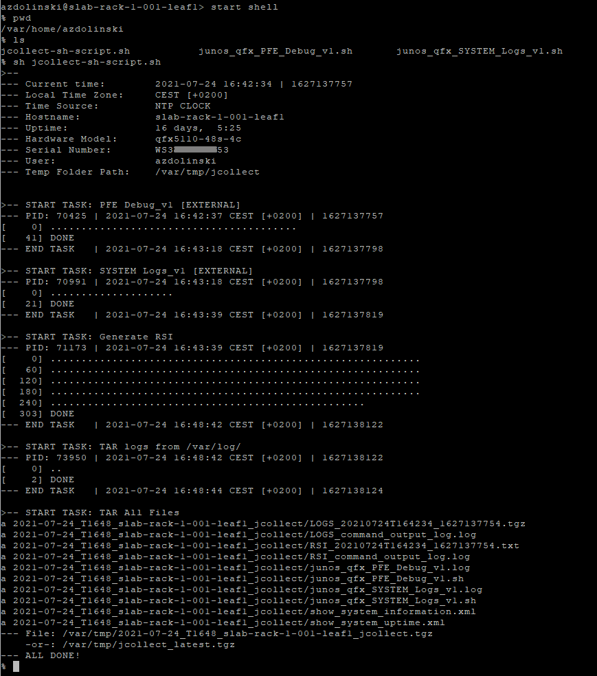
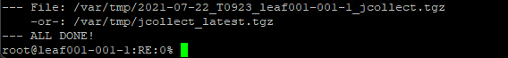
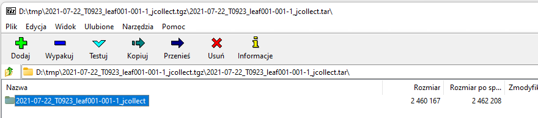
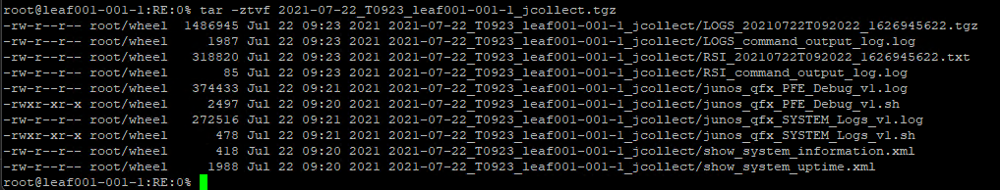
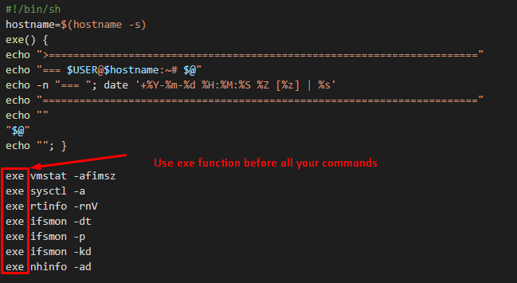

# jcollect-run-script
Juniper Techsupport Collector





## About script
Script <strong><em>jcollect-sh-script.sh</em></strong> needs to be run on Juniper device.<br>
After start from the shell level - it will collect basic system informations to <strong><em>/var/tmp/jcollect</em></strong> folder.
<ul>
<li>it will generate <strong>RSI</strong> (<strong>R</strong>equest <strong>S</strong>upport <strong>I</strong>nformation).</li>
<li>archive logs from <strong><em>/var/log</em></strong> folder</li>
<li>run additional <strong>EXTERNAL scripts</strong> which names starts from <strong>junos_|junos-qfx_|evo_</strong> and include output of this scripts in final TAR archive.</li>
</ul>

<strong>You decide</strong> what additional data you whant to collect. Just inclide additional EXTERNAL file in same folder where is located <strong><em>jcollect-sh-script.sh</em></strong>
<br>

## How to use
```cli
{master:0}
root@Juniper> start shell

root@Juniper:RE:0% pwd
/var/root

root@Juniper:RE:0% ls -la j*
-rwxr-xr-x  1 root  wheel  6838 Jul 22 08:47 jcollect-sh-script.sh
-rwxr-xr-x  1 root  wheel  2497 Jul 22 08:47 junos-qfx_5100_PFE_Debug_v1.sh
-rwxr-xr-x  1 root  wheel   478 Jul 22 08:47 junos-qfx_5100_SYSTEM_Logs_v1.sh

root@Juniper:RE:0% sh jcollect-sh-script.sh
```

## Result
Script will create Archive TGZ file in <strong>/var/tmp/</strong> folder.<br><br>

Syntax: <strong>\<date-YY-MM-DD\>\_T\<time-HH-MM\>_\<hostname\>_jcollect.tgz</strong> <br><br>

It will also create link to latest created file: <strong>/var/tmp/jcollect_latest.tgz</strong>.<br>
<br><br>

Archive folder inside this TGZ will have same naming syntax:<br>
<br><br>

Example of TGZ content:<br>



## EXTERNAL scripts
<strong>You decide</strong> what additional data you whant to collect.<bt>
You can create your own script and put in same directory where you have jcollect-sh-script.sh.<br>
Your script should have syntax:  <strong>\<junos|junos-qfx|evo\>\_\<device-model\>\_\<script-name\>.sh</strong><br>
Please include print function <strong>exe</strong> on the top of the script. This function will add additional time stamp and also will include name of executed commands inside log file - this will make the file analysis easier.<br>

```bash
#!/bin/sh
hostname=$(hostname -s)
exe() {
echo ">======================================================================"
echo "=== $USER@$hostname:~# $@"
echo -n "=== "; date '+%Y-%m-%d %H:%M:%S %Z [%z] | %s'
echo "======================================================================="
echo ""
"$@" 
echo ""; }
```

<br>

<span style="color:red"><strong>** IMPORTANT **</strong></span><br>
Please note that maximum time in which EXTERNAL task should be finished is set to 1800 seconds.<br>
If you think that your task can take longer - please modyfie <strong>TASKTIMEOUT</strong> value inside jcolector-sh-script or split your EXTERNAL script for several smaller tasks.<br>
On Juniper device you can change this paramter by <strong>sed</strong> command:
```sh
root@Juniper:RE:0% grep "TASKTIMEOUT=" jcollect-sh-script.sh
TASKTIMEOUT=1800
root@Juniper:RE:0% sed -i -e 's/TASKTIMEOUT=1800/TASKTIMEOUT=3600/g' jcollect-sh-script.sh
root@Juniper:RE:0% grep "TASKTIMEOUT=" jcollect-sh-script.sh
TASKTIMEOUT=3600
```

<br>
Example:<br>
Please find below example of EXTERNAL script:<br>




## Linux->Juniper
HowTo: Copy script files to Juniper device by SCP:
```console
# Copy 3 files to Juniper IP: 10.20.30.40
scp jcollect* junos_CLI_ROUTE.sh junos-qfx_QFX5100_SYSTEM_Logs_v1.sh root@10.20.30.40:

# Without asking for password
sshpass -p 'PASSWORD' scp jcollect* junos_CLI_ROUTE.sh junos-qfx_QFX5100_SYSTEM_Logs_v1.sh root@10.20.30.40:
```


## Juniper->Linux
HowTo: Download JCOLLECT TGZ file and decompress on your Linux:
```console
cd /tmp/
sshpass -p 'root123' scp root@10.240.40.30:/var/tmp/jcollect_latest.tgz .
mkdir jcollect
tar zxvf jcollect_latest.tgz -C /tmp/jcollect
cd jcollect
ls
> 2021-07-26_T0033_leaf001-001-1_jcollect
cd 2021-07-26_T0033_leaf001-001-1_jcollect/
ls
> LOGS_20210726T003146_1627259506.tgz  LOGS_command_output_log.log  RSI_20210726T003146_1627259506.txt  RSI_command_output_log.log  junos_CLI_BGP.log  junos_CLI_BGP.sh  xml
tar zxvf LOGS_20210726T003146_1627259506.tgz 
rm LOGS_*
ls
> RSI_20210726T003146_1627259506.txt  RSI_command_output_log.log  junos_CLI_BGP.log  junos_CLI_BGP.sh  log  xml
```

## ADDON - JCollect Log Unpacking
If you put on Juniper device also "jcollect-log-unpacking.py" togethere with <strong>jcollect-sh</strong> - this python script will be included in Archve LOGS TGZ file. <br>
When you decomress LOGS TGZ file, you can use this file on your local device to unpack all <strong>*.gz</strong>. <br>
This script will also create ie. <strong>messages_merge</strong> which will include all <strong>messeges\*</strong> files merge in the correct chronology. <br>

```console
pwd
> /tmp/jcollect/2021-07-24_T0209_leaf001-001-1_jcollect/log
ls jcollect*
> jcollect-log-unpacking.py

python3 jcollect-log-unpacking.py
```
Output example:<br>
```console
root@Linux:/tmp/jcollect/2021-07-24_T0209_leaf001-001-1_jcollect/log# ./jcollect-log-unpacking.py 

>-- log: interactive-commands* ---
|-- GUNZIP ./interactive-commands.4.gz -> ./interactive-commands.4
|-- REMOVE: interactive-commands.4.gz
|-- GUNZIP ./interactive-commands.0.gz -> ./interactive-commands.0
|-- REMOVE: interactive-commands.0.gz
|-- GUNZIP ./interactive-commands.8.gz -> ./interactive-commands.8
|-- REMOVE: interactive-commands.8.gz
|-- GUNZIP ./interactive-commands.6.gz -> ./interactive-commands.6
|-- REMOVE: interactive-commands.6.gz
|-- GUNZIP ./interactive-commands.3.gz -> ./interactive-commands.3
|-- REMOVE: interactive-commands.3.gz
|-- GUNZIP ./interactive-commands.9.gz -> ./interactive-commands.9
|-- REMOVE: interactive-commands.9.gz
|-- GUNZIP ./interactive-commands.1.gz -> ./interactive-commands.1
|-- REMOVE: interactive-commands.1.gz
|-- GUNZIP ./interactive-commands.2.gz -> ./interactive-commands.2
|-- REMOVE: interactive-commands.2.gz
|-- GUNZIP ./interactive-commands.5.gz -> ./interactive-commands.5
|-- REMOVE: interactive-commands.5.gz
|-- GUNZIP ./interactive-commands.7.gz -> ./interactive-commands.7
|-- REMOVE: interactive-commands.7.gz
|-- MERGE TO: interactive-commands_merge
 |-- FILE: interactive-commands.9 SIZE: 483.579KiB  [495185]
 |-- FILE: interactive-commands.8 SIZE: 482.853KiB  [494441]
 |-- FILE: interactive-commands.7 SIZE: 486.400KiB  [498074]
 |-- FILE: interactive-commands.6 SIZE: 482.860KiB  [494449]
 |-- FILE: interactive-commands.5 SIZE: 540.341KiB  [553309]
 |-- FILE: interactive-commands.4 SIZE: 488.217KiB  [499934]
 |-- FILE: interactive-commands.3 SIZE: 495.734KiB  [507632]
 |-- FILE: interactive-commands.2 SIZE: 501.418KiB  [513452]
 |-- FILE: interactive-commands.1 SIZE: 510.241KiB  [522487]
 |-- FILE: interactive-commands.0 SIZE: 494.884KiB  [506761]
 |-- FILE: interactive-commands SIZE: 367.169KiB  [375981]
----------------------------------------------------------------------------------------------------


>-- log: mib2d* ---
|-- GUNZIP ./mib2d.0.gz -> ./mib2d.0
|-- REMOVE: mib2d.0.gz
|-- GUNZIP ./mib2d.4.gz -> ./mib2d.4
|-- REMOVE: mib2d.4.gz
|-- GUNZIP ./mib2d.3.gz -> ./mib2d.3
|-- REMOVE: mib2d.3.gz
|-- GUNZIP ./mib2d.1.gz -> ./mib2d.1
|-- REMOVE: mib2d.1.gz
|-- GUNZIP ./mib2d.2.gz -> ./mib2d.2
|-- REMOVE: mib2d.2.gz
|-- MERGE TO: mib2d_merge
 |-- FILE: mib2d.4 SIZE: 990.519KiB  [1014291]
 |-- FILE: mib2d.3 SIZE: 990.516KiB  [1014288]
 |-- FILE: mib2d.2 SIZE: 990.540KiB  [1014313]
 |-- FILE: mib2d.1 SIZE: 990.476KiB  [1014247]
 |-- FILE: mib2d.0 SIZE: 990.474KiB  [1014245]
 |-- FILE: mib2d SIZE: 103.595KiB  [106081]
----------------------------------------------------------------------------------------------------


>-- log: messages* ---
|-- GUNZIP ./messages.3.gz -> ./messages.3
|-- REMOVE: messages.3.gz
|-- GUNZIP ./messages.4.gz -> ./messages.4
|-- REMOVE: messages.4.gz
|-- GUNZIP ./messages.8.gz -> ./messages.8
|-- REMOVE: messages.8.gz
|-- GUNZIP ./messages.0.gz -> ./messages.0
|-- REMOVE: messages.0.gz
|-- GUNZIP ./messages.2.gz -> ./messages.2
|-- REMOVE: messages.2.gz
|-- GUNZIP ./messages.7.gz -> ./messages.7
|-- REMOVE: messages.7.gz
|-- GUNZIP ./messages.5.gz -> ./messages.5
|-- REMOVE: messages.5.gz
|-- GUNZIP ./messages.9.gz -> ./messages.9
|-- REMOVE: messages.9.gz
|-- GUNZIP ./messages.1.gz -> ./messages.1
|-- REMOVE: messages.1.gz
|-- GUNZIP ./messages.6.gz -> ./messages.6
|-- REMOVE: messages.6.gz
|-- MERGE TO: messages_merge
 |-- FILE: messages.9 SIZE: 249.396KiB  [255381]
 |-- FILE: messages.8 SIZE: 246.397KiB  [252311]
 |-- FILE: messages.7 SIZE: 255.753KiB  [261891]
 |-- FILE: messages.6 SIZE: 250.625KiB  [256640]
 |-- FILE: messages.5 SIZE: 252.042KiB  [258091]
 |-- FILE: messages.4 SIZE: 245.555KiB  [251448]
 |-- FILE: messages.3 SIZE: 249.303KiB  [255286]
 |-- FILE: messages.2 SIZE: 247.055KiB  [252984]
 |-- FILE: messages.1 SIZE: 240.481KiB  [246253]
 |-- FILE: messages.0 SIZE: 380.741KiB  [389879]
 |-- FILE: messages SIZE: 94.734KiB  [97008]
----------------------------------------------------------------------------------------------------


>-- log: wtmp* ---
|-- GUNZIP ./wtmp.0.gz -> ./wtmp.0
|-- REMOVE: wtmp.0.gz


>-- log: chassisd* ---
|-- GUNZIP ./chassisd.0.gz -> ./chassisd.0
|-- REMOVE: chassisd.0.gz
|-- MERGE TO: chassisd_merge
 |-- FILE: chassisd.0 SIZE: 2.894MiB  [3034265]
 |-- FILE: chassisd SIZE: 66.239KiB  [67829]
----------------------------------------------------------------------------------------------------


>-- log: dcd* ---
|-- GUNZIP ./dcd.0.gz -> ./dcd.0
|-- REMOVE: dcd.0.gz
|-- MERGE TO: dcd_merge
 |-- FILE: dcd.0 SIZE: 976.478KiB  [999913]
 |-- FILE: dcd SIZE: 18.967KiB  [19422]
----------------------------------------------------------------------------------------------------
```