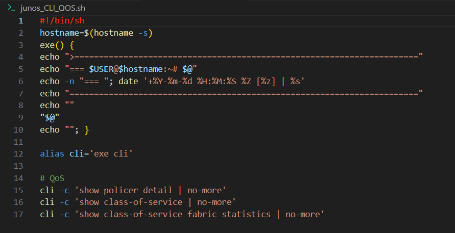

# jcollect-run-script
Juniper Techsupport Collector


# About script:
Script <strong><em>jcollect-sh-script.sh</em></strong> needs to be run on Juniper device.<br>
<ul>
<li>It will collect basic system information to <strong><em>/var/tmp/jcollect</em></strong> folder.</li>
<li>It will generate <strong>RSI</strong> (request support information).</li>
<li>It will archive logs from <strong><em>/var/log</em></strong> folder.</li>
<li>It will run additional <strong>EXTERNAL scripts</strong> which names starts from junos_*.sh|evo_ *.sh and include output in final TAR archive. <strong>You decide</strong> what additional data you whant to collect.</li>
</ul>
<br>

# How to use:
```cli
{master:0}
root@leaf001-001-1> start shell

root@leaf001-001-1:RE:0% pwd
/var/root

root@leaf001-001-1:RE:0% ls -la j*
-rwxr-xr-x  1 root  wheel  6838 Jul 22 08:47 jcollect-sh-script.sh
-rwxr-xr-x  1 root  wheel  2497 Jul 22 08:47 junos_qfx_PFE_Debug_v1.sh
-rwxr-xr-x  1 root  wheel   478 Jul 22 08:47 junos_qfx_SYSTEM_Logs_v1.sh

root@leaf001-001-1:RE:0% sh jcollect-sh-script.sh
```

# Result:
Script will create file in <strong>/var/tmp/</strong> folder.<br>
File name syntax: <strong>\<date-YY-MM-DD\>_T\<time-HH-MM\>_\<hostname\>_jcollect.tgz</strong> .<br>
It will also create link to latest created file: <strong>/var/tmp/jcollect_latest.tgz</strong>.<br>
<br><br>

Archive folder inside this TGZ will have same naming syntax:<br>
<br><br>

Example of TGZ content:<br>


# EXTERNAL scripts:
<strong>You decide</strong> what additional data you whant to collect.<bt>
You can create your own script and put in same directory where you have jcollect-sh-script.sh.<br>
Your script should have syntax:  <strong>\<junos|junos-qfx|evo\>_\<device-model\>_\<name\>.sh</strong><br>
Please include print function <strong>exe</strong> on the top of the script. This will function will add additional time stamp and also will include full command inside log file - so that will allow much bettere understand when and what command you include in your script.<br>

```bash
#!/bin/sh
hostname=$(hostname -s)
exe() {
echo ">======================================================================"
echo -n "=== "; date '+%Y-%m-%d %H:%M:%S %Z [%z] | %s'
echo "======================================================================="
echo  "$USER@$hostname:~# $@"
echo ""
"$@" 
echo ""; }
```

<br>
Please find below example of EXTERNAL script with name <strong>junos-qfx_5100_SYSTEM_Logs_v1.sh</strong><br>

